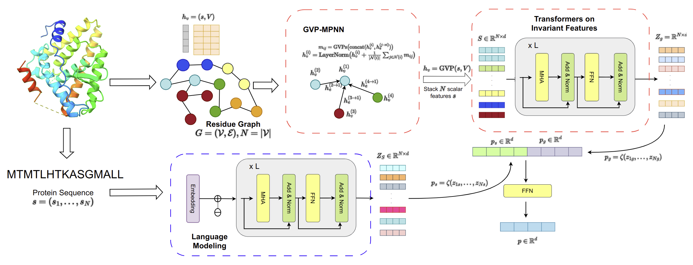
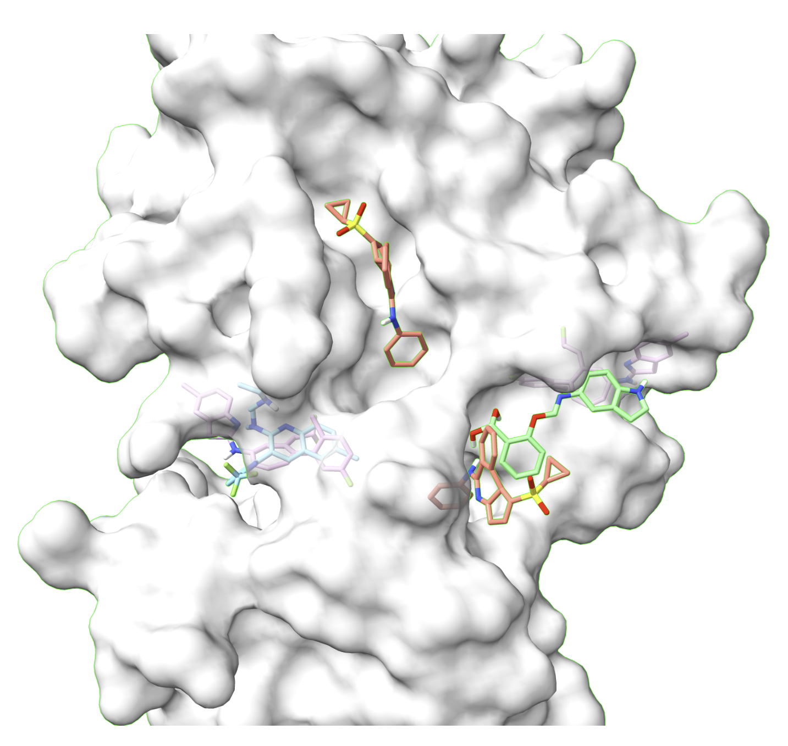

# Target-aware Variational Auto-encoders for Ligand Generation with Multimodal Protein Representation Learning



Paper:
https://doi.org/10.1101/2023.08.10.552868

Contributors:
* Nhat Khang Ngo
* Truong Son Hy (Correspondent / PI)
  
### Data Preprocessing
Three-dimensional structures of proteins are stored in two compressed files, prot_3d_for_Davis.tar.gz, and prot_3d_for_kiba.tar.gz.
You should move to the folder **data**, and run these commands:
```
cd davis
tar –xvzf prot_3d_for_Davis.tar.gz
```
and 
```
cd kiba
tar -xvzf prot_3d_for_kiba.tar.gz
```
Then, you can run:
```
python3 process_protein_3d.py --data {data_name} --device cuda:0
```
here, data_name is in {kiba, davis}.
### Training Binding Affinity Prediction 
You can run:
```
python3 train_binding_affinity.py --data {data_name} --fold_idx {fold_idx}
```
data_name is in {kiba, davis} and fold_idx should be in {0,1,2,3,4}.

### Training Ligand Generation
We provide a checkpoint for pre-trained unconditional VAEs. You can download it from [here](https://drive.google.com/file/d/1NWtaokYSxmYvt7u2UbdiHfGlD4DeRxVQ/view?usp=sharing). 

Then, the downloaded file should be placed in the same directory as the train_vae.py file.

You can run:
```
python3 train_vae.py
```
### Sampling and Evaluation with proteins in the test set.
You can run:
```
python3 generate_ligand.py --num_mols 100
```

### Generating ligands with specific pdb file:
A pdb file should be stored in the /data directory. Then, you can run:
```
python3 generate_specific_target.py --protein_name [target name]
```
with the PDB file has the format as {target_name}.pdb.



### Please cite our paper with the following bibtex!
```bibtex
@article {Ngo2023.08.10.552868,
	author = {Nhat Khang Ngo and Truong Son Hy},
	title = {Target-aware Variational Auto-encoders for Ligand Generation with Multimodal Protein Representation Learning},
	elocation-id = {2023.08.10.552868},
	year = {2023},
	doi = {10.1101/2023.08.10.552868},
	publisher = {Cold Spring Harbor Laboratory},
	abstract = {Without knowledge of specific pockets, generating ligands based on the global structure of a protein target plays a crucial role in drug discovery as it helps reduce the search space for potential drug-like candidates in the pipeline. However, contemporary methods require optimizing tailored networks for each protein, which is arduous and costly. To address this issue, we introduce TargetVAE, a target-aware variational auto-encoder that generates ligands with high binding affinities to arbitrary protein targets, guided by a novel multimodal deep neural network built based on graph Transformers as the prior for the generative model. This is the first effort to unify different representations of proteins (e.g., sequence of amino-acids, 3D structure) into a single model that we name as Protein Multimodal Network (PMN). Our multimodal architecture learns from the entire protein structures and is able to capture their sequential, topological and geometrical information. We showcase the superiority of our approach by conducting extensive experiments and evaluations, including the assessment of generative model quality, ligand generation for unseen targets, docking score computation, and binding affinity prediction. Empirical results demonstrate the promising performance of our proposed approach. Our software package is publicly available at https://github.com/HySonLab/Ligand_GenerationCompeting Interest StatementThe authors have declared no competing interest.},
	URL = {https://www.biorxiv.org/content/early/2023/08/11/2023.08.10.552868},
	eprint = {https://www.biorxiv.org/content/early/2023/08/11/2023.08.10.552868.full.pdf},
	journal = {bioRxiv}
}
```

### References
```bibtex
@inproceedings{NEURIPS DATASETS AND BENCHMARKS2021_c45147de,
 author = {Townshend, Raphael and V\"{o}gele, Martin and Suriana, Patricia and Derry, Alex and Powers, Alexander and Laloudakis, Yianni and Balachandar, Sidhika and Jing, Bowen and Anderson, Brandon and Eismann, Stephan and Kondor, Risi and Altman, Russ and Dror, Ron},
 booktitle = {Proceedings of the Neural Information Processing Systems Track on Datasets and Benchmarks},
 editor = {J. Vanschoren and S. Yeung},
 pages = {},
 publisher = {Curran},
 title = {ATOM3D: Tasks on Molecules in Three Dimensions},
 url = {https://datasets-benchmarks-proceedings.neurips.cc/paper_files/paper/2021/file/c45147dee729311ef5b5c3003946c48f-Paper-round1.pdf},
 volume = {1},
 year = {2021}
}
```

```bibtex
@Article{D3RA00281K,
author ="Voitsitskyi, Taras and Stratiichuk, Roman and Koleiev, Ihor and Popryho, Leonid and Ostrovsky, Zakhar and Henitsoi, Pavlo and Khropachov, Ivan and Vozniak, Volodymyr and Zhytar, Roman and Nechepurenko, Diana and Yesylevskyy, Semen and Nafiiev, Alan and Starosyla, Serhii",
title  ="3DProtDTA: a deep learning model for drug-target affinity prediction based on residue-level protein graphs",
journal  ="RSC Adv.",
year  ="2023",
volume  ="13",
issue  ="15",
pages  ="10261-10272",
publisher  ="The Royal Society of Chemistry",
doi  ="10.1039/D3RA00281K",
url  ="http://dx.doi.org/10.1039/D3RA00281K",
abstract  ="Accurate prediction of the drug-target affinity (DTA) in silico is of critical importance for modern drug discovery. Computational methods of DTA prediction{,} applied in the early stages of drug development{,} are able to speed it up and cut its cost significantly. A wide range of approaches based on machine learning were recently proposed for DTA assessment. The most promising of them are based on deep learning techniques and graph neural networks to encode molecular structures. The recent breakthrough in protein structure prediction made by AlphaFold made an unprecedented amount of proteins without experimentally defined structures accessible for computational DTA prediction. In this work{,} we propose a new deep learning DTA model 3DProtDTA{,} which utilises AlphaFold structure predictions in conjunction with the graph representation of proteins. The model is superior to its rivals on common benchmarking datasets and has potential for further improvement."}
```
